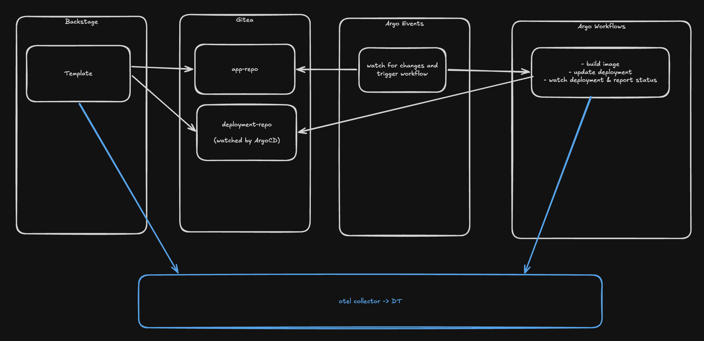

# Problem 1 — Service Creation

**Problem:** Developer wants a new service → asks around, gets inconsistent answers, waits days for ops.  
**Solution shown:** Backstage Software Template — one form, full golden path, wired up automatically.  
**Backstage feature:** Software Templates | **DevEx pillar:** Flow State

∫

---

## Demo Flow

Two repos per service: `<service-name>` (app code) and `<service-name>-deployment` (k8s manifests).

```
Developer clicks "Create" in Backstage template UI

Backstage scaffolder (OTel-instrumented):
  → custom action "create:gitea-repo":
      - injects active OTel context → gets traceparent string
      - creates Gitea repo "<service-name>" with app skeleton
      - initial commit message: "feat: initialize service\n\nTrace-Parent: <traceparent>"
      - creates Gitea repo "<service-name>-deployment" with k8s manifests
      - registers service in Backstage catalog (catalog-info.yaml)

Argo Events:
  → Gitea push webhook firesperfec
  → Sensor extracts full commit message ($.commits[0].message) as workflow parameter
  → triggers Argo Workflow

Argo Workflow:
  → step 1 (parse-traceparent): shell script extracts traceparent from commit message
                                 → output parameter: traceparent
  → step 2 (build):             builds Docker image  [TRACEPARENT env var set]
  → step 3 (push):              pushes image to in-cluster registry  [TRACEPARENT env var set]
  → step 4 (update-manifests):  commits new image tag to "<service-name>-deployment"  [TRACEPARENT env var set]
  → step 5 (wait-for-deploy):   kubectl rollout status → blocks until pod is running  [TRACEPARENT env var set]
                                 → when this exits: trace is complete

ArgoCD:
  → detects manifest change in "<service-name>-deployment"
  → syncs → service is running
```

One continuous OTel trace from "Create clicked" to "pod running."

---

## Trace Design

**Carrier:** W3C `traceparent` embedded in the initial commit message.

**Why commit message?**
- Backstage already has Gitea API access — no new permissions
- Gitea push webhook includes commit messages → Argo Events can pass it as a workflow parameter
- Developer commits after the initial one won't have the header → fresh trace automatically

**Getting the traceparent in the custom action (Node.js):**
```typescript
import { context, propagation } from '@opentelemetry/api';
const carrier: Record<string, string> = {};
propagation.inject(context.active(), carrier);
const traceparent = carrier['traceparent'];
```

**Parsing it in the workflow (step 1):**
```bash
echo "$COMMIT_MSG" | grep -oP 'Trace-Parent: \K\S+'
```
Output as Argo parameter → passed to all subsequent steps as `TRACEPARENT` env var:
```yaml
env:
  - name: TRACEPARENT
    value: "{{steps.parse-traceparent.outputs.parameters.traceparent}}"
```

**Production note — ArgoCD:**  
In production you'd want real spans from ArgoCD (sync start, sync end, health check) via ArgoCD Notifications sending to a custom webhook receiver that emits spans. For this demo, the `wait-for-deploy` workflow step (kubectl rollout status) is a pragmatic substitute — it captures the right duration without instrumenting ArgoCD itself.

**Argo Events is invisible in the trace:**  
It has no OTel instrumentation. The trace jumps directly from the Backstage scaffolder span to the first Argo Workflow step. There will be a small visible time gap (webhook delivery + trigger latency, typically a few seconds) with no span covering it — same trace ID, connected, just no span for the routing layer itself.

**Closing the trace (step 5):**  
`kubectl rollout status` blocks until the pod is running. Since `TRACEPARENT` is set, this step's span is a child of the original scaffolder span. When it exits: done.  
No ArgoCD Notifications needed.

---

## Stack

| Component | Purpose |
|-----------|---------|
| Backstage | Template UI + scaffolder |
| Gitea | Git provider |
| Argo Events | Gitea webhook → workflow trigger |
| Argo Workflows | CI pipeline (build → push → deploy wait) |
| ArgoCD | GitOps deployment (ApplicationSet, auto-sync) |
| In-cluster registry | Docker image storage |
| OTel Collector | Collects traces, forwards to Dynatrace |

All deployed in kind via Helm. Backstage and Argo Workflows export traces via `OTEL_EXPORTER_OTLP_ENDPOINT`.

---

## What Needs to Be Built

### Backstage
- [ ] OTel env vars in Helm values (`OTEL_EXPORTER_OTLP_ENDPOINT`, `OTEL_SERVICE_NAME: backstage`)
- [ ] Catalog seed entities: `Group`, `User`, `System` for the fictional platform team
- [ ] Custom scaffolder action `create:gitea-repo`:
  - reads active OTel span via `propagation.inject`
  - creates repo via Gitea API
  - makes initial commit with `Trace-Parent: <traceparent>` in message
- [ ] Software Template (`template.yaml`):
  1. Inputs: service name, team, language
  2. Fetch skeleton
  3. `create:gitea-repo` for `<service-name>`
  4. `create:gitea-repo` for `<service-name>-deployment`
  5. `catalog:register`
- [ ] App skeleton (`skeleton/app/`): `catalog-info.yaml`, hello-world Go service, `Dockerfile`, TechDocs stub
- [ ] Deployment skeleton (`skeleton/deployment/`): `deployment.yaml` + `service.yaml` with image tag as template variable

### Argo Events
- [ ] `EventSource` — Gitea push webhook
- [ ] `Sensor` — passes `$.commits[0].message` as workflow parameter, triggers workflow

### Argo Workflows
- [ ] `WorkflowTemplate` with steps: parse-traceparent → build → push → update-manifests → wait-for-deploy
- [ ] All steps after step 1 receive `TRACEPARENT` via output parameter reference
- [ ] OTel env vars on workflow controller (`OTEL_EXPORTER_OTLP_ENDPOINT`, `OTEL_SERVICE_NAME: argo-workflows`)
- [ ] RBAC for image push to in-cluster registry

### ArgoCD
- [ ] `ApplicationSet` watching Gitea org for repos matching `*-deployment`, auto-sync on

### Cluster / Devcontainer
- [ ] kind config with port mappings (Backstage, Gitea, ArgoCD UI, Argo Workflows UI)
- [ ] kind `containerdConfigPatches` for in-cluster registry
- [ ] Init scripts for each component
- [ ] `.devcontainer/devcontainer.json`

---

## Metrics to Show

| Metric | Where |
|--------|-------|
| % of services created via templates | Backstage catalog: filter by `backstage.io/scaffolded-from` annotation |
| Template completion / error rate | Argo Workflows UI: successful vs failed runs |
| Time from Create click to pod running | OTel trace: scaffolder start span → wait-for-deploy end span |
| % of pipeline runs completing fully | Argo Workflows: completed vs triggered workflow count |

---

## Decisions

- **Skeleton language:** Go
- **Dynatrace:** OTel Collector forwards externally; DT endpoint + token as devcontainer env vars
- **ArgoCD UI:** exposed by default via katharinasick/devcontainer-lib
